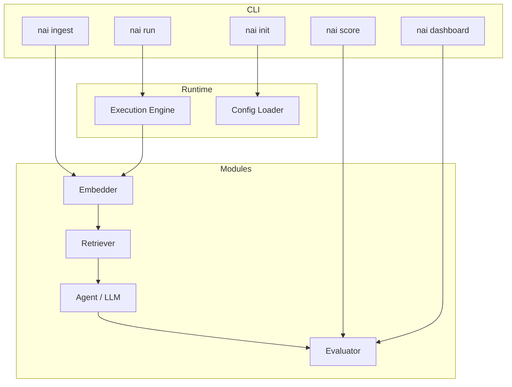

# 🏗️ NnennaAI Architecture

> **Goal:** Give contributors a mental model of how NnennaAI stitches modules, runtime, and observability into one composable framework—so we can extend features without rewriting fundamentals.

## 1. Executive Overview

NnennaAI follows a **layered, config‑driven** design:

1. **CLI Layer** – single entry point (`nai`) that parses flags, merges config, and invokes the runtime.
2. **Runtime Layer** – an execution engine that resolves the pipeline DAG, orchestrates concurrency, and emits traces.
3. **Module Layer** – plug‑and‑play units (embedder, retriever, LLM/agent, evaluator) that implement a shared interface.
4. **State & Storage Layer** – adapters for vector stores, blob stores, and run history (default: Chroma + SQLite).

A minimal pipeline can live entirely on a laptop; the same YAML can later execute on distributed backends.

## 2. Layer Diagram (MVP)



> _Diagram Notes:_ The arrows show default flow for a RAG pipeline. Modules communicate only through typed inputs/outputs—never by side effects—ensuring swap‑in compatibility. The `Execution Engine` is for concurrency and tracing. The `Config Loader` is a YAML file.

## 3. Module Interface Contract

```python
from abc import ABC, abstractmethod
from typing import Any, Dict

class ModuleBase(ABC):
    """Every plug‑in module extends this interface."""

    @abstractmethod
    def setup(self, **kwargs):
        """Initialize weights, DB connections, etc."""

    @abstractmethod
    def forward(self, payload: Any, **context) -> Any:
        """Pure function: payload → output. No global state allowed."""

    @abstractmethod
    def teardown(self):
        """Clean up resources."""
```

_Key guarantees:_ idempotent `forward`, JSON‑serializable I/O, timeout‑aware.

## 4. Execution Engine & Concurrency

- **Mode:** async task graph with bounded worker pool (default 8).
- **Fault Policy:** automatic retry ×2, exponential backoff, circuit‑breaker after 3 failures.
- **Tracing:** each task emits OpenTelemetry spans; `--trace` streams live to stdout.

## 5. Config‑Driven Pipeline Definition

```yaml
# pipeline.yaml (minimal RAG)
loader:
  glob: "./docs/**/*.md"
  chunk: 400
embedder:
  type: openai-emb-3-small
retriever:
  type: chroma
llm:
  model: gpt-4o
```

_Precedence:_ `CLI flag` > `ENV var` > `pipeline.yaml` > hard‑coded defaults.

## 6. Data & Control Flow

1. **Ingest phase** (`nai ingest`) populates store with `(chunk, embedding, metadata)` triples.
2. **Run phase** (`nai run`) streams prompt → embedder → retriever → llm.
3. **Score phase** (`nai score`) replays traces through evaluator metrics.
4. Feedback loop: low scores can auto‑trigger different retrievers or models (future work).

## 7. Plug‑in & Versioning Mechanism

- Python entry‑points under `nai.modules` namespace.
- Semantic handshake: `implements: nai.module@1.x` in plugin `pyproject.toml`.
- Core runtime rejects incompatible major versions with a helpful error.

## 8. State & Storage Abstractions

| Layer        | Default Adapter | Swap‑in Examples |
| ------------ | --------------- | ---------------- |
| Vector Store | Chroma          | Weaviate, Qdrant |
| Blob Store   | Local FS        | S3, GCS          |
| Run History  | SQLite          | Postgres, DuckDB |

Adapters wrap the same CRUD interface so modules remain storage‑agnostic.

## 9. Observability & Tracing Hooks

- **Spans:** `pipeline`, `module`, `task` levels.
- **Live logs:** stream to stdout when `--trace` is set.
- **Dashboard:** `nai dashboard` converts SQLite run DB → static HTML (observable offline).

## 10. Error Handling & Fallback Strategy

| Scenario       | Default Response                     | Configurable?       |
| -------------- | ------------------------------------ | ------------------- |
| Module timeout | Retry ×2 then skip                   | ✅ `max_retries`    |
| LLM 5xx error  | Circuit‑break for 60 s               | ✅ `breaker_window` |
| Eval failure   | Mark run `degraded` but keep metrics | ➖                  |

Fallback modules (e.g. a cheaper LLM) can be declared in `pipeline.yaml` under `llm.fallback`.

## 11. Security & Secrets Management (Stub)

- Secrets loaded from `.env` or your OS keyring.
- Network egress can be denied per module (`allow_net: false`).
- Future: sandbox runners for untrusted plugins.

## 12. Future Directions & Open Questions

- Multi‑agent protocol (MCP++) for cooperative pipelines.
- Distributed executor that maps the DAG to Kubernetes jobs.
- DAG visualizer integrated into the dashboard.

> ✋ **Contribute Ideas:** Open an issue with the label `architecture` or start a GitHub Discussion. This doc is reviewed quarterly and whenever we cut a minor version.
