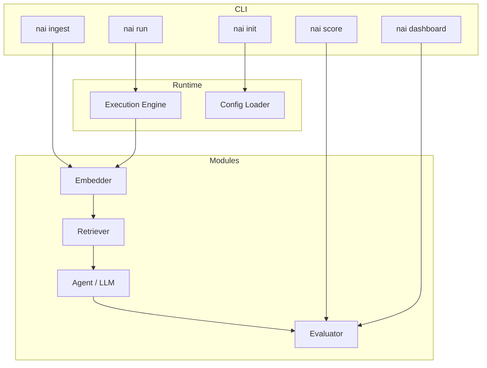

# 🧭 NnennaAI Overview

Welcome to **NnennaAI**—the developer‑first, open‑source framework for orchestrating GenAI pipelines, agents, and evaluations with **minimal lift and maximal clarity**.

> **Mission:** Make building trustworthy, composable GenAI systems as fast and intuitive as running a single CLI command.

---

## ⚡️ Why NnennaAI Exists

| Pain in the GenAI Landscape                                                      | How NnennaAI Fixes It                                                              |
| -------------------------------------------------------------------------------- | ---------------------------------------------------------------------------------- |
| **Glue‑code fatigue**—every project starts with copy‑pasting LangChain snippets. | **`nai init`** scaffolds a runnable pipeline in seconds—zero boilerplate.          |
| **Opaque agents**—you can’t see why your AI chose a step.                        | Built‑in tracing (`--trace`) + deterministic fallback show every decision.         |
| **Quality is an afterthought**—most stacks demo but don’t measure.               | **`nai score`** captures RAGAS quality, latency, and cost on every run.            |
| **Monolithic frameworks** lock you into one vector DB or LLM.                    | Modules are **plug‑and‑play**: swap embedder, retriever, store, or LLM via config. |

NnennaAI embodies our manifesto principles:

- **Modular > Monolithic**
- **CLI‑first is developer‑first**
- **Own your evals before you own your AI**
- **Simplicity is strength**

---

## 🏗️ How It Works (High‑Level Architecture)



_Developers interact \***\*only\*\*** with the CLI and YAML config; every box inside Modules can be replaced without touching core code._

---

## 🚀 Happy‑Path Workflow

```bash
# 1. Install CLI
pipx install nai

# 2. Scaffold a RAG project
nai init rag-starter

# 3. Index your markdown docs
nai ingest ./docs/**/*.md

# 4. Ask a question
nai run "What is our retry strategy?"

# 5. Measure quality & cost
nai score --save runs.db

# 6. Share insights
nai dashboard --export report.html
```

Time‑to‑First‑Answer: **<10 min**.

---

## 🔌 Plug‑and‑Play Modules

Default modules shipping with **v0.1.0**:

| Category    | Default                                | Swap Examples                        |
| ----------- | -------------------------------------- | ------------------------------------ |
| Embedder    | `openai/text-embedding-3-small`        | `voyage-2`, `bge-base`               |
| Retriever   | `Chroma`                               | `FAISS`, `Weaviate`                  |
| LLM / Agent | `openai/gpt-4o`                        | `Anthropic/claude-3`, `local/yi-34b` |
| Evaluator   | `RAGAS` (faithfulness, answer quality) | Custom Python metric plugin          |

Swap via one line:

```bash
nai config set llm=local/yi-34b-chat-q4
```

---

## 📈 What Success Looks Like

- **Zero boilerplate** before first answer.
- **Observable runs**—step traces logged automatically.
- **Quantified quality & cost** via `nai score`.
- **Module swaps in <30 s** with no code edits.

These DX goals drive our roadmap and acceptance tests.

---

## 🗺️ Roadmap Snapshot

- **Module Marketplace**—discover & install third‑party retrievers and evaluators.
- **`nai test`** - **GitHub Action**—CI template that runs `nai score` gates.
- **Evaluation Dashboard v2**—historical run comparison and trend charts.
- **Multi‑agent workflow support** (MCP++ prototype).

Follow progress in [GitHub Projects](https://github.com/NnennaAI/NnennaAI/projects).

---

## 🔗 Where to Go Next

- **Quick Start →** [`quick-start.md`](./quick-start.md)
- **CLI Reference →** [`cli.md`](./cli.md)
- **Architecture Details →** [`architecture.md`](./architecture.md)
- **Contributing Guide →** [`CONTRIBUTING.md`](../CONTRIBUTING.md)

> _NnennaAI is a living framework and so is this doc—open an issue with ideas, feedback, or clarifications._
